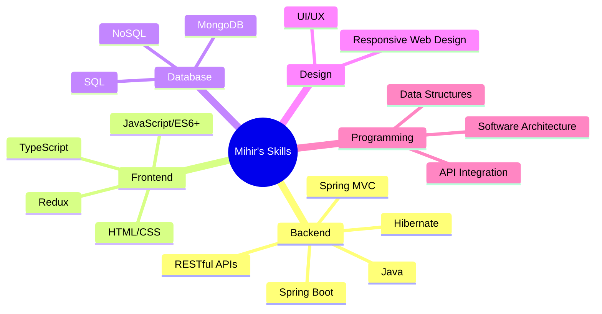

# <div align="center">👨‍💻 Mihir Somavanshi</div>

<div align="center">
  
</div>

<div align="center">
  
</div>

<div align="center">
  <a href="mailto:mirvansh18@gmail.com"></a>
  <a href="https://github.com/yourusername"></a>
  <a href="https://your-portfolio-url.com"></a>
  <a href="tel:+917887617100"></a>
</div>

<br>

> *"Results-driven Java Developer with proven success improving web performance by 20% and boosting user engagement by 40%. Specializes in building scalable, user-centric applications using Spring Boot, Hibernate, and RESTful APIs. Combines deep expertise in backend architecture, database optimization, and AI integration to deliver responsive solutions."*

## 📊 GitHub Stats

<div align="center">
  
  
</div>

<div align="center">
  
</div>

## 💻 Tech Stack

<div align="center">
  
### Backend


### Frontend


### Styling


### Database


### Tools & Others


</div>

## 🧠 Skills Breakdown



## 🎓 Education

<div align="center">
  <table>
    <tr>
      <th>Degree</th>
      <th>Institution</th>
      <th>Duration</th>
      <th>CGPA</th>
    </tr>
    <tr>
      <td>MCA (Masters in Computer Application)</td>
      <td>Sinhgad Institute of Management and Computer Application, Pune</td>
      <td>2022-2024</td>
      <td>7.9</td>
    </tr>
    <tr>
      <td>BSc (Bachelor of Science)</td>
      <td>Nanasaheb Yashvantrao Narayanrao Chavan Arts, Science & Commerce College</td>
      <td>Graduated 2022</td>
      <td>9.2</td>
    </tr>
  </table>
</div>

## 💼 Experience

<div align="center">
  <table>
    <tr>
      <th>Company</th>
      <th>Position</th>
      <th>Duration</th>
      <th>Key Responsibilities</th>
    </tr>
    <tr>
      <td>Forage (Walmart Global Tech)</td>
      <td>Virtual Experience Program</td>
      <td>January 2024</td>
      <td>
        • Advanced Data Structures<br>
        • Software Architecture<br>
        • Relational Database Design<br>
        • Data Munging
      </td>
    </tr>
  </table>
</div>

## 🌟 Portfolio Projects

<div align="center">
  <a href="https://github.com/yourusername/project1">
    
  </a>
  <a href="https://github.com/yourusername/project2">
    
  </a>
</div>

## 🌱 I'm currently learning

- Advanced Spring Framework Concepts
- Microservices Architecture
- Cloud Computing (AWS/Azure)
- DevOps Practices

## 📫 Connect With Me

<div align="center">
  <a href="https://linkedin.com/in/yourusername">
    
  </a>
  <a href="https://twitter.com/yourusername">
    
  </a>
  <a href="https://discord.com/users/yourdiscordid">
    
  </a>
  <a href="https://medium.com/@yourusername">
    
  </a>
</div>

## 📊 Weekly Coding Stats

```text
Java         █████████████████░░░░░   70%
JavaScript   ██████░░░░░░░░░░░░░░░░   25%
HTML/CSS     ███░░░░░░░░░░░░░░░░░░░   15%
Python       ██░░░░░░░░░░░░░░░░░░░░   10%
```

<div align="center">
  
  
  
</div>

<div align="center">
  
</div>

---

<div align="center">
  
</div>
